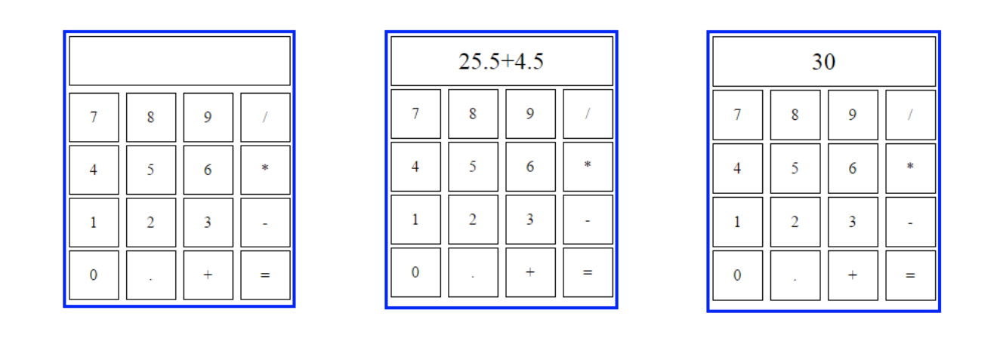

{: .x .mx-auto .d-block .my-5 .md .d-md-none .w-50}
{: .d-none .d-md-inline-block .ml-3 .mb-5 .float-right width="200px"}

# Codelab Exercise 1: The Almost Simple Calculator

Implement a calculator with the functionality given below.

- When a button is clicked the value should be appended to the display div (middle figure).

- When the equal sign is clicked, the result of the calculation must be presented (last figure).



- Use the HTML and css given below to get started

```html
<div id="container">
    <div id="display" class="t4"></div>
    <div id="buttons">
      <div class="t1">7</div>
      <div class="t1">8</div>
      <div class="t1">9</div>
      <div class="t1">/</div>

      <div class="t1">4</div>
      <div class="t1">5</div>
      <div class="t1">6</div>
      <div class="t1">*</div>

      <div class="t1">1</div>
      <div class="t1">2</div>
      <div class="t1">3</div>
      <div class="t1">-</div>

      <div class="t1">0</div>
      <div class="t1">.</div>
      <div class="t1">+</div>
      <div id="calculate" class="t1">=</div>
  </div>
</div>
```

```css
#container {
    width: 226px;
    height: 274px;
    border: 3px solid darkblue;
    margin: auto
}
.t1, .t4 {
    border: 1px solid black;
    height: 48px;
    margin-left: 3px;
    margin-top: 3px;
    display: inline-block;
    text-align: center;
    line-height: 48px;
}
.t1 {
    width: 48px;
}
.t4 {
    width: 219px;
}
```

## Hints

These are just hints, there are many ways to solve this problem.

### Event bubbling

- Assign a single click event handler to the div with the buttons id to handle anything but the `=` button.
- Use your knowledge about event bubbling and the events target property to get the text in the div that was clicked (via the innerText property).
- Assign a new event handler to the div with the “calculate” id. Use the event argument's `.stopPropagation()` method to prevent this event from bubbling up to your “outer” event handler.

### Calculation of the result

- Use the `eval()` function to evaluate the expression directly. This is the easiest way to solve this problem. But be aware that `eval()` is not recommended for production code, as it can be a security risk. Can you decribe why that is?
