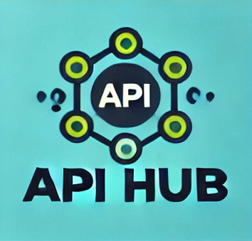
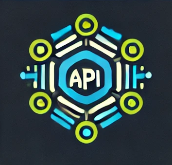

  

# SP-2: The API Hub

Later in the semester, we will learn to build frontend applications that can use data from various APIs. So the idea is to build a selection of cool APIs that we can pick and choose from later on.

Each team decide on what kind of API they would like to build. Be creative and have fun with it. Remembe though, that other teams should be able to use your product. Therefore each team should document their API. Also, each team will hand in a link to their API so that we can create a common API hub.

## General Requirements

This project is meant to be a group exercise. [Teams of 2-3 is preferable](https://cphbusiness.mrooms.net/mod/choicegroup/view.php?id=736176). The scope is 5 working days. The requirements are as follows:

### 1. The API

1. Build the API with the techstack and architecture we have used so far. This means that you should use Javalin, JPA, DTOs, Java streams, and **optionally** fetching data from other REST API's.
2. Make sure that you have a good selection of endpoints. You should have at least 4 unique endpoints per team member - and all CRUD methods should be implemented.
3. The endpoints should be secured with JWT tokens. Decide which roles you want to have in your API. Like USER, ADMIN etc.
4. Make sure that you implement good error handling in your API, and that the API returns the correct status codes and error messages in json format.
5. Create an http file with manual tests.

### 2. Documenting the API

{: .ml-3 .my-5 .float-right style="width: 25%;"}

1. At the beginning of the project, you should decide on the endpoints you would like to have in your API (before you start coding). Use this basic method described in the toolbox: [API documentation](../../toolbox/rest/api_documentation.md). Fill out the Word Document and [hand it in on Moodle](https://cphbusiness.mrooms.net/mod/assign/view.php?id=736177) together with a brief description of what the API is about. Some sort of a vision for the API. The teachers will review the documentation and give you feedback.

2. The finished API should show the Javalin built in route overview on the `/api/routes endpoint`. Make it public so that we can see it.

### 3. Testing the API (and DAOs)

You should write enough tests to cover the important functionality of the backend.

1. Write tests for the DAO and Service Layer. Use JUnit, Hamcrest, and test containers. You don't need to test all methods in the Service Layer, and certainly not in the DTOs and Entities. But you should test the methods that are directly used in the endpoints.

2. Write tests for the endpoints. Use JUnit, Hamcrest, Rest Assured, and test containers. You should also test the security of the endpoints, and not only happy path cases. Also test the error handling in the API. Could be for unauthorized access, not found, bad request etc.

### 4. Deploying the API

1. You should deploy the API to a Digital Ocean Droplet.

2. You should use the deployment pipeline we have introduced. So GitHub Actions, Docker Hub, Docker Compose files, and Watchtower to keep the API Container up to date. You should also use Caddy to serve the API over HTTPS on a sub-domain.

## How to structure your week

Below is a suggestion of how you can structure the project. You are free to structure the project as you see fit. Maybe it's a good idea to create a project in Github and then invite your group members to the project. Then you can work on the project together. Then build some startcode.  Also, you need to setup the deployment pipeline for the project early on in the project. This will make it easier to deploy the project at the end.

## Day 1: Monday - getting started

1. [Sign up your team on Moodle](https://cphbusiness.mrooms.net/mod/choicegroup/view.php?id=736176).
2. Write a description of what the API is about.
3. Decide and document the endpoints of the API +  Hand in the documentation on Moodle. [Hand it in here](https://cphbusiness.mrooms.net/mod/assign/view.php?id=736177).
4. Sketch some diagrams of the API. A database ER diagram would be helpful early on.
5. Create a new project in IntelliJ IDEA and set up the project structure.
6. Share the code on Github with the team.

## Day 2: Tuesday

1. Implement the DTOs, Entities, the DAO and Service layer. Write the CRUD methods for the entities and what is needed for the endpoints.
2. Setup the deployment pipeline and make work.
3. Create a populator to populate the database with some data. This makes it easier to manually test the endpoints and also later in  the automated tests.
4. Begin writing tests for the DAO and Service layer. Maybe just setting it up and writing a few tests.

## Day 3: Wednesday

1. Implement the endpoints little by little. Create the routes and the controllers.
2. Create a http file to manually test the endpoints.
3. Finish the tests for the DAO and Service layer.

## Day 4: Thursday

1. Finish the endpoints
2. Write tests for the endpoints. Make sure to test the security and error handling of the endpoints. Begin little by little.

## Day 5: Friday

1. Finish the tests for the endpoints.
2. Refactor the code and make sure that the code is clean and readable. Do this in pairs.
3. Deploy the API to a Digital Ocean Droplet one last time.
4. Hand in the assignment on Moodle. Make sure to include a link to the Github repository and one link to the deployed api. One group member should hand in the assignment per group. NB! You can wait until Sunday evening to hand in the assignment if you wish so.

## Review (Monday, October 28)

{: .mr-5 .my-4 .float-left style="width: 25%;"}

Monday is showtime! All the teachers and their teams will jump on Zoom together from 9:00 to 11:00. We’ll spend two hours reviewing all the projects, with each group presenting their work. Imagine you're pitching the project to a customer—be ready to explain the backend functionality and your design choices. The “customers” will ask questions and give feedback, and the teachers will also share their thoughts.
